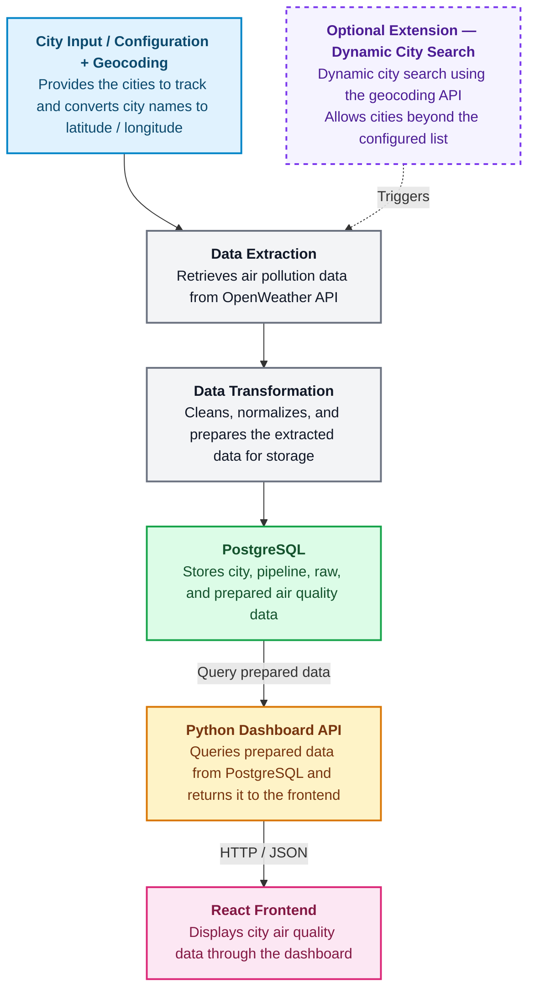

# City Air Tracker — Architecture

## 1. Product and Data Pipeline Summary

### The problem

Air quality data for different cities exists and is accessible (e.g., through the OpenWeather API), but in its raw form it's scattered and impractical to use directly: getting readings for multiple cities means making separate geocoding and historical air-pollution requests for each city individually, and the results come back as nested JSON with possible gaps, duplicates, and inconsistent timestamp formats. Having the dashboard hit the API and parse this raw data on every request would be slow and unreliable. City Air Tracker solves this by collecting data for all the configured cities in one place and turning it into a single clean format the dashboard can rely on.

### Data the product needs

- a list of cities from configuration (which cities to track);
- coordinates for those cities, obtained via OpenWeather's geocoding API;
- historical air pollution data for those coordinates, also from the OpenWeather API.

### What the ETL stages do

- **Extract** — calls the OpenWeather geocoding and air pollution endpoints for each configured city and stores the raw responses as-is in PostgreSQL, so they can be re-inspected later without making another API call.
- **Transform** — parses these raw responses, removes duplicate or invalid records, normalizes timestamps to a consistent format, and calculates any derived metrics needed.
- **Load** — writes the resulting cleaned ("gold") dataset to PostgreSQL, which is the data source for the dashboard.

### How this supports the dashboard

By the time the dashboard needs the data, all the prep work is already done: the React frontend requests the data from our Python API, which queries the prepared tables in PostgreSQL. As a result, no OpenWeather API calls or JSON parsing occur during the request. This keeps the dashboard fast and reliable, and keeps all the data-cleaning logic centralized and easy to test separately from the UI.

## 2. Target Architecture

**Plan:** _This architecture may change as the team learns more_

