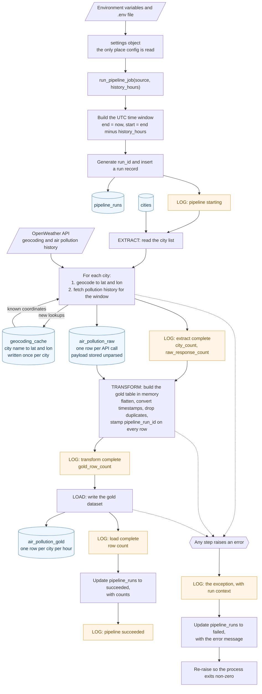

# Planned Runtime Flow

## Purpose

This document describes the expected behavior of the City Air Tracker pipeline each time it runs.

This is a design plan, not a completed implementation. The pipeline does not run yet. The order of operations follows the `run_pipeline_job()` scaffolding in `services/pipeline/src/pipeline/orchestration/__init__.py`, and the documentation should remain aligned with the eventual implementation.

PostgreSQL is the main store for this plan, and every stage below reads or writes it. Table names are the ones we plan to use.

It may not stay the only store. The `PublishResult` type in the orchestration scaffolding carries `gold_path` and `azure_blob_path` next to `postgres_table`, so the load stage may also write a Parquet copy and push it to Azure. That work is not built yet and is out of scope here. This doc should be updated when it lands.

## Flow at a glance

All five tables live in the same PostgreSQL database.

## Tables

| Table | Purpose |
|---|---|
| `cities` | The cities we track. Read at the start of extract, never written by the pipeline. |
| `pipeline_runs` | One row per pipeline execution, with status and counts. |
| `geocoding_cache` | City name to latitude and longitude, written once per city. |
| `air_pollution_raw` | One row per API call, holding the response exactly as received. |
| `air_pollution_gold` | The cleaned dataset, one row per city per hour. |

The city input contract defines the fields on `cities`.

## Step by step

### Setup

1. **Load configuration:** Configuration is loaded from environment variables and the local .env file into a single settings object. No later pipeline stage reads environment variables directly.

2. **Build the time window:** The pipeline creates a UTC-based time window where end is the current UTC time and start is end minus history_hours. This start and end pair is passed to the OpenWeather history endpoint. All timestamps remain in UTC throughout the pipeline.

3. **Create a pipeline run record:** A run_id is generated from the current UTC timestamp (for example, 20260803T140501Z). A row is inserted into `pipeline_runs`, and the database returns a numeric pipeline_run_id. Both identifiers are carried throughout the pipeline output and logs, allowing us to trace a single pipeline execution and identify which run produced any given gold row.

4. **Log pipeline start:** The pipeline logs the start of execution, including the run identifiers and requested time window.

   Extract → Transform → Load

   The pipeline executes these stages sequentially. Each stage must complete successfully before the next stage begins.

5. **Extract:** The extract stage reads the city list from `cities` and processes cities one at a time:

   - Geocode each city name to obtain latitude and longitude, reusing `geocoding_cache` when the city has been seen before.
   - Request pollution history for those coordinates within the requested time window.
   - Insert the response into `air_pollution_raw` exactly as received, before any parsing or transformation.

   Keeping raw responses allows the gold dataset to be rebuilt later without making additional API requests.

   Cities are processed one at a time. Sequential extract keeps the order of API calls easy to follow and keeps us comfortably inside the OpenWeather rate limit while the city list is short. If the list grows enough that extract becomes slow, running cities in parallel is worth looking at in a later sprint.

6. **Transform:** The transform stage reads from `air_pollution_raw` and builds the gold dataset in memory as a pandas DataFrame.

   The transformation process:

   - Flattens the nested list[] API response into one row per city per timestamp.
   - Converts dt Unix timestamps into UTC timestamps.
   - Removes duplicate and invalid records.
   - Keeps the AQI value and eight pollutant measurements.
   - Adds pipeline_run_id to every row.

   No persistent writes happen during this stage, making it easier to test independently.

7. **Load:** The load stage writes the completed gold dataset to `air_pollution_gold`. This is the table the dashboard API reads from.

   Postgres is the primary target, not necessarily the only one. If the Parquet and Azure outputs sketched in `PublishResult` get built, they will come out of this same stage. The gold table is what the rest of this document assumes.

8. **Close out the run:** `pipeline_runs` is updated to succeeded, recording the city count, raw response count, and gold row count.

## Where configuration enters

Configuration enters in one place, at step 1, and reaches the rest of the pipeline through `settings`.

| Setting | What it controls |
|---|---|
| OpenWeather API key | Authenticates every API call. Never committed to the repository. |
| PostgreSQL connection details | Which database every stage reads from and writes to. |
| `history_hours` | How far back the requested window reaches. |

## Read and write responsibilities

| Stage | Reads from | Writes to |
|---|---|---|
| Configuration | Environment variables, `.env` | Nothing |
| Run setup | Nothing | `pipeline_runs` |
| Extract | `cities`; `geocoding_cache`; OpenWeather geocoding and history endpoints | `air_pollution_raw`; new entries in `geocoding_cache` |
| Transform | `air_pollution_raw` | Nothing |
| Load | The in-memory gold table | `air_pollution_gold` (Parquet and Azure copies are possible later, not planned here) |
| Run close-out | Nothing | Status update on `pipeline_runs` |

Only the extract stage communicates with external APIs, and only the load stage publishes the final dataset.

## Where we log

Every log line carries run_id and pipeline_run_id, so one run's activity can be pulled out of a mixed log.

| When | Level | What it records |
|---|---|---|
| Pipeline starting | info | Source, history_hours, window start and end |
| Extract starting | info | Run identifiers and source |
| Extract complete | info | Number of cities, number of raw responses |
| Transform starting | info | Number of raw responses going in |
| Transform complete | info | Number of gold rows produced |
| Load starting | info | Number of gold rows to write |
| Load complete | info | Rows written to `air_pollution_gold` |
| Pipeline succeeded | info | All counts |
| Any failure | error, with traceback | Where it failed, plus the counts reached so far |

## When a step fails

If any stage raises an exception, the pipeline performs the following actions:

1. Log the exception with context.
   
   The error log includes the traceback, run identifiers, and counts reached before failure.

2. Mark the run as failed.
   
   The pipeline_runs record is updated with the error message, completion time, and progress counts.
   
3. Re-raise the exception. 
   
   The process exits with a non-zero status so the caller knows the pipeline failed.

Errors are never silently ignored. The run record remains useful for debugging because raw responses collected before failure are preserved, and the record shows how far execution progressed.

A failure anywhere stops the whole run, including a failure on a single city during extract. We chose this while we are still learning the API, because one obvious failure is easier to diagnose than a dataset quietly missing some cities. We expect to revisit it in a later sprint, along with adding bounded retries around the two API calls.
