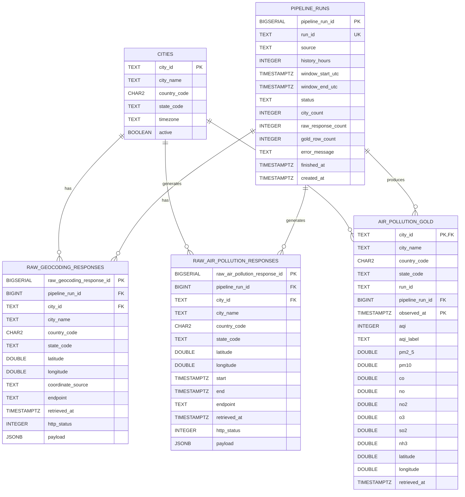
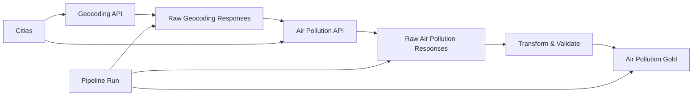

# City Air Tracker Database Schema

## Overview

This document defines the PostgreSQL schema for the City Air Tracker pipeline. The schema is based on the Sprint 2 raw response contract, Sprint 3 transform data dictionary, city input contract, and pipeline run tracking requirements.

The City Air Tracker PostgreSQL database contains five tables:

| Table                         | Purpose                                                     |
| ----------------------------- | ----------------------------------------------------------- |
| `cities`                      | Stores configured cities and location reference data        |
| `pipeline_runs`               | Tracks each pipeline execution                              |
| `raw_geocoding_responses`     | Stores raw geocoding API responses                          |
| `raw_air_pollution_responses` | Stores raw air pollution API responses                      |
| `air_pollution_gold`          | Stores transformed and validated air pollution observations |

---

## Database Schema

### `cities`

Stores configured city and location reference information.

| Column         | PostgreSQL Type | Required | Key / Constraint | Description                         |
| -------------- | --------------- | -------: | ---------------- | ----------------------------------- |
| `city_id`      | `TEXT`          |      Yes | **PK**           | Stable identifier for the city      |
| `city_name`    | `TEXT`          |      Yes | —                | City name                           |
| `country_code` | `CHAR(2)`       |      Yes | —                | ISO country code                    |
| `state_code`   | `TEXT`          |       No | —                | State/province code when applicable |
| `timezone`     | `TEXT`          |      Yes | —                | IANA timezone                       |
| `active`       | `BOOLEAN`       |      Yes | No default       | Whether the city is active          |

**Unique constraint:** `city_name`, `country_code`, and `state_code`, treating a missing `state_code` as an empty value.

---

### `pipeline_runs`

Tracks each execution of the pipeline.

| Column               | PostgreSQL Type | Required | Key / Constraint                 | Description                              |
| -------------------- | --------------- | -------: | -------------------------------- | ---------------------------------------- |
| `pipeline_run_id`    | `BIGSERIAL`     |      Yes | **PK**                           | Database identifier for the pipeline run |
| `run_id`             | `TEXT`          |      Yes | **UNIQUE**                       | Pipeline run identifier                  |
| `source`             | `TEXT`          |      Yes | —                                | Pipeline/source name                     |
| `history_hours`      | `INTEGER`       |      Yes | `> 0`                            | Number of historical hours requested     |
| `window_start_utc`   | `TIMESTAMPTZ`   |      Yes | —                                | Start of requested data window           |
| `window_end_utc`     | `TIMESTAMPTZ`   |      Yes | `>= window_start_utc`            | End of requested data window             |
| `status`             | `TEXT`          |      Yes | `running`, `succeeded`, `failed` | Current pipeline status                  |
| `city_count`         | `INTEGER`       |      Yes | `>= 0`                           | Number of cities processed               |
| `raw_response_count` | `INTEGER`       |      Yes | `>= 0`                           | Number of raw responses stored           |
| `gold_row_count`     | `INTEGER`       |      Yes | `>= 0`                           | Number of transformed rows               |
| `error_message`      | `TEXT`          |       No | —                                | Error information when a run fails       |
| `finished_at`        | `TIMESTAMPTZ`   |       No | —                                | Time the pipeline finished               |
| `created_at`         | `TIMESTAMPTZ`   |      Yes | Default `NOW()`                  | Time the pipeline run was created        |

---

### `raw_geocoding_responses`

Stores raw responses from the geocoding API, including the location context and coordinates produced by the geocoding step.

Repeated requests are retained rather than overwritten.

| Column                      | PostgreSQL Type    | Required | Key / Constraint                         | Description                                     |
| --------------------------- | ------------------ | -------: | ---------------------------------------- | ----------------------------------------------- |
| `raw_geocoding_response_id` | `BIGSERIAL`        |      Yes | **PK**                                   | Unique identifier for the stored response       |
| `pipeline_run_id`           | `BIGINT`           |      Yes | **FK** → `pipeline_runs.pipeline_run_id` | Pipeline run that generated the response        |
| `city_id`                   | `TEXT`             |      Yes | **FK** → `cities.city_id`                | Stable city identifier                          |
| `city_name`                 | `TEXT`             |      Yes | —                                        | City name included in the response context      |
| `country_code`              | `CHAR(2)`          |      Yes | —                                        | ISO country code                                |
| `state_code`                | `TEXT`             |       No | —                                        | State/province code when available              |
| `latitude`                  | `DOUBLE PRECISION` |       No | `-90–90`                                 | Latitude returned by the API or fallback table  |
| `longitude`                 | `DOUBLE PRECISION` |       No | `-180–180`                               | Longitude returned by the API or fallback table |
| `coordinate_source`         | `TEXT`             |      Yes | `geocoded`, `fallback`, `absent`         | Source of the coordinates                       |
| `endpoint`                  | `TEXT`             |      Yes | —                                        | API endpoint used                               |
| `retrieved_at`              | `TIMESTAMPTZ`      |      Yes | —                                        | UTC time when the response was received         |
| `http_status`               | `INTEGER`          |       No | `100–599`                                | HTTP response status                            |
| `payload`                   | `JSONB`            |      Yes | —                                        | Original raw API response                       |

**Uniqueness:** No request-level uniqueness constraint is applied because repeated API requests must be retained.

**Coordinate fields:** `latitude` and `longitude` are nullable because a geocoding response can have no coordinates. `coordinate_source` records whether coordinates came from the API, the fallback coordinate table, or were absent.

---

### `raw_air_pollution_responses`

Stores raw responses from the air pollution API, including the city context, coordinates used for the request, and requested time window.

Repeated requests are retained rather than overwritten.

| Column                          | PostgreSQL Type    | Required | Key / Constraint                         | Description                                |
| ------------------------------- | ------------------ | -------: | ---------------------------------------- | ------------------------------------------ |
| `raw_air_pollution_response_id` | `BIGSERIAL`        |      Yes | **PK**                                   | Unique identifier for the stored response  |
| `pipeline_run_id`               | `BIGINT`           |      Yes | **FK** → `pipeline_runs.pipeline_run_id` | Pipeline run that generated the response   |
| `city_id`                       | `TEXT`             |      Yes | **FK** → `cities.city_id`                | Stable city identifier                     |
| `city_name`                     | `TEXT`             |      Yes | —                                        | City name included in the response context |
| `country_code`                  | `CHAR(2)`          |      Yes | —                                        | ISO country code                           |
| `state_code`                    | `TEXT`             |       No | —                                        | State/province code when available         |
| `latitude`                      | `DOUBLE PRECISION` |      Yes | `-90–90`                                 | Latitude used for the API request          |
| `longitude`                     | `DOUBLE PRECISION` |      Yes | `-180–180`                               | Longitude used for the API request         |
| `start`                         | `TIMESTAMPTZ`      |      Yes | —                                        | Start of the requested UTC time window     |
| `end`                           | `TIMESTAMPTZ`      |      Yes | `>= start`                               | End of the requested UTC time window       |
| `endpoint`                      | `TEXT`             |      Yes | —                                        | API endpoint used                          |
| `retrieved_at`                  | `TIMESTAMPTZ`      |      Yes | —                                        | UTC time when the response was received    |
| `http_status`                   | `INTEGER`          |       No | `100–599`                                | HTTP response status                       |
| `payload`                       | `JSONB`            |      Yes | —                                        | Original raw API response                  |

**Uniqueness:** No request-level uniqueness constraint is applied because repeated API requests must be retained.

**Location fields:** `latitude` and `longitude` record the coordinates actually used in the air pollution API request, making the stored response self-describing without requiring a lookup against the geocoding response.

**Request window:** `start` and `end` record the UTC time range requested for the API call.

**Timestamp:** `retrieved_at` is supplied by the extract layer and represents the time the response was received. It does not use a database default because database insertion time may differ from response-retrieval time.

---

### `air_pollution_gold`

Stores transformed and validated air pollution observations.

**Grain:** One row per city per observation.

| Column            | PostgreSQL Type    | Required | Key / Constraint                         | Description                              |
| ----------------- | ------------------ | -------: | ---------------------------------------- | ---------------------------------------- |
| `city_id`         | `TEXT`             |      Yes | **PK, FK** → `cities.city_id`            | Stable identifier for the city           |
| `city_name`       | `TEXT`             |      Yes | —                                        | City name                                |
| `country_code`    | `CHAR(2)`          |      Yes | —                                        | ISO country code                         |
| `state_code`      | `TEXT`             |       No | —                                        | State/province code when applicable      |
| `run_id`          | `TEXT`             |      Yes | —                                        | Pipeline run identifier                  |
| `pipeline_run_id` | `BIGINT`           |      Yes | **FK** → `pipeline_runs.pipeline_run_id` | Database identifier for the pipeline run |
| `observed_at`     | `TIMESTAMPTZ`      |      Yes | **PK**                                   | Time of the air pollution observation    |
| `aqi`             | `INTEGER`          |      Yes | `1–5`                                    | Air Quality Index                        |
| `aqi_label`       | `TEXT`             |      Yes | —                                        | Human-readable label for the AQI value   |
| `pm2_5`           | `DOUBLE PRECISION` |      Yes | `>= 0`                                   | PM2.5 concentration                      |
| `pm10`            | `DOUBLE PRECISION` |      Yes | `>= 0`                                   | PM10 concentration                       |
| `co`              | `DOUBLE PRECISION` |      Yes | `>= 0`                                   | Carbon monoxide concentration            |
| `no`              | `DOUBLE PRECISION` |      Yes | `>= 0`                                   | Nitrogen monoxide              |
| `no2`             | `DOUBLE PRECISION` |      Yes | `>= 0`                                   | Nitrogen dioxide concentration           |
| `o3`              | `DOUBLE PRECISION` |      Yes | `>= 0`                                   | Ozone concentration                      |
| `so2`             | `DOUBLE PRECISION` |      Yes | `>= 0`                                   | Sulfur dioxide concentration             |
| `nh3`             | `DOUBLE PRECISION` |      Yes | `>= 0`                                   | Ammonia concentration                    |
| `latitude`        | `DOUBLE PRECISION` |      Yes | `-90–90`                                 | Geographic latitude                      |
| `longitude`       | `DOUBLE PRECISION` |      Yes | `-180–180`                               | Geographic longitude                     |
| `retrieved_at`    | `TIMESTAMPTZ`      |       No | —                                        | Time the data was retrieved              |

**Primary key:** `(city_id, observed_at)`

`retrieved_at` is nullable because it is not currently produced by the transform output and is subject to confirmation in AIR-19.

`pipeline_run_id` references the database pipeline run record, while `run_id` preserves the pipeline run identifier required by the transform contract.

---

## Schema Constraints & Relationships

| Table                         | Primary Key                     | Foreign Keys                                                                        | Required Columns                                                                                                                                                                        | Unique Constraints                                                   |
| ----------------------------- | ------------------------------- | ----------------------------------------------------------------------------------- | --------------------------------------------------------------------------------------------------------------------------------------------------------------------------------------- | -------------------------------------------------------------------- |
| `cities`                      | `city_id`                       | None                                                                                | `city_id`, `city_name`, `country_code`, `timezone`, `active`                                                                                                                            | `(city_name, country_code, state_code)` with `NULL` treated as empty |
| `pipeline_runs`               | `pipeline_run_id`               | None                                                                                | `run_id`, `source`, `history_hours`, `window_start_utc`, `window_end_utc`, `status`, `city_count`, `raw_response_count`, `gold_row_count`, `created_at`                                 | `run_id`                                                             |
| `raw_geocoding_responses`     | `raw_geocoding_response_id`     | `pipeline_run_id` → `pipeline_runs.pipeline_run_id`<br>`city_id` → `cities.city_id` | `pipeline_run_id`, `city_id`, `city_name`, `country_code`, `coordinate_source`, `endpoint`, `retrieved_at`, `payload`                                                                   | None                                                                 |
| `raw_air_pollution_responses` | `raw_air_pollution_response_id` | `pipeline_run_id` → `pipeline_runs.pipeline_run_id`<br>`city_id` → `cities.city_id` | `pipeline_run_id`, `city_id`, `city_name`, `country_code`, `latitude`, `longitude`, `start`, `end`, `endpoint`, `retrieved_at`, `payload`                                               | None                                                                 |
| `air_pollution_gold`          | `(city_id, observed_at)`        | `pipeline_run_id` → `pipeline_runs.pipeline_run_id`<br>`city_id` → `cities.city_id` | `city_id`, `city_name`, `country_code`, `run_id`, `pipeline_run_id`, `observed_at`, `aqi`, `aqi_label`, `pm2_5`, `pm10`, `co`, `no`, `no2`, `o3`, `so2`, `nh3`, `latitude`, `longitude` | None                                                                 |

### Check Constraints

| Table                         | Constraint               | Rule                                                                                            |
| ----------------------------- | ------------------------ | ----------------------------------------------------------------------------------------------- |
| `pipeline_runs`               | `history_hours`          | Must be greater than `0`                                                                        |
| `pipeline_runs`               | `window_end_utc`         | Must be greater than or equal to `window_start_utc`                                             |
| `pipeline_runs`               | `status`                 | Must be `running`, `succeeded`, or `failed`                                                     |
| `pipeline_runs`               | `city_count`             | Must be greater than or equal to `0`                                                            |
| `pipeline_runs`               | `raw_response_count`     | Must be greater than or equal to `0`                                                            |
| `pipeline_runs`               | `gold_row_count`         | Must be greater than or equal to `0`                                                            |
| `raw_geocoding_responses`     | `coordinate_source`      | Must be `geocoded`, `fallback`, or `absent`                                                     |
| `raw_geocoding_responses`     | `latitude`               | Must be between `-90` and `90` when present                                                     |
| `raw_geocoding_responses`     | `longitude`              | Must be between `-180` and `180` when present                                                   |
| `raw_geocoding_responses`     | `http_status`            | Must be between `100` and `599` when present                                                    |
| `raw_air_pollution_responses` | `latitude`               | Must be between `-90` and `90`                                                                  |
| `raw_air_pollution_responses` | `longitude`              | Must be between `-180` and `180`                                                                |
| `raw_air_pollution_responses` | `end`                    | Must be greater than or equal to `start`                                                        |
| `raw_air_pollution_responses` | `http_status`            | Must be between `100` and `599` when present                                                    |
| `air_pollution_gold`          | `aqi`                    | Must be between `1` and `5`                                                                     |
| `air_pollution_gold`          | Pollutant concentrations | `pm2_5`, `pm10`, `co`, `no`, `no2`, `o3`, `so2`, and `nh3` must be greater than or equal to `0` |
| `air_pollution_gold`          | `latitude`               | Must be between `-90` and `90`                                                                  |
| `air_pollution_gold`          | `longitude`              | Must be between `-180` and `180`                                                                |

### Relationships

| From Table                    | Column            | Relationship | To Table        | Column            |
| ----------------------------- | ----------------- | ------------ | --------------- | ----------------- |
| `raw_geocoding_responses`     | `pipeline_run_id` | FK           | `pipeline_runs` | `pipeline_run_id` |
| `raw_geocoding_responses`     | `city_id`         | FK           | `cities`        | `city_id`         |
| `raw_air_pollution_responses` | `pipeline_run_id` | FK           | `pipeline_runs` | `pipeline_run_id` |
| `raw_air_pollution_responses` | `city_id`         | FK           | `cities`        | `city_id`         |
| `air_pollution_gold`          | `pipeline_run_id` | FK           | `pipeline_runs` | `pipeline_run_id` |
| `air_pollution_gold`          | `city_id`         | FK           | `cities`        | `city_id`         |

## Entity Relationship Diagram



### Simplified pipeline flow


## CREATE TABLE Statements

```sql
CREATE TABLE cities (
    city_id       TEXT PRIMARY KEY,
    city_name     TEXT NOT NULL,
    country_code  CHAR(2) NOT NULL,
    state_code    TEXT,
    timezone      TEXT NOT NULL,
    active        BOOLEAN NOT NULL
);

CREATE UNIQUE INDEX cities_city_identity_unique
    ON cities (
        city_name,
        country_code,
        COALESCE(state_code, '')
    );


CREATE TABLE pipeline_runs (
    pipeline_run_id    BIGSERIAL PRIMARY KEY,
    run_id             TEXT NOT NULL UNIQUE,
    source             TEXT NOT NULL,
    history_hours      INTEGER NOT NULL,
    window_start_utc   TIMESTAMPTZ NOT NULL,
    window_end_utc     TIMESTAMPTZ NOT NULL,
    status             TEXT NOT NULL DEFAULT 'running',
    city_count         INTEGER NOT NULL DEFAULT 0,
    raw_response_count INTEGER NOT NULL DEFAULT 0,
    gold_row_count     INTEGER NOT NULL DEFAULT 0,
    error_message      TEXT,
    finished_at        TIMESTAMPTZ,
    created_at         TIMESTAMPTZ NOT NULL DEFAULT NOW(),

    CONSTRAINT pipeline_runs_history_hours_positive
        CHECK (history_hours > 0),

    CONSTRAINT pipeline_runs_window_valid
        CHECK (window_end_utc >= window_start_utc),

    CONSTRAINT pipeline_runs_city_count_nonnegative
        CHECK (city_count >= 0),

    CONSTRAINT pipeline_runs_raw_response_count_nonnegative
        CHECK (raw_response_count >= 0),

    CONSTRAINT pipeline_runs_gold_row_count_nonnegative
        CHECK (gold_row_count >= 0),

    CONSTRAINT pipeline_runs_status_valid
        CHECK (status IN ('running', 'succeeded', 'failed'))
);


CREATE TABLE raw_geocoding_responses (
    raw_geocoding_response_id BIGSERIAL PRIMARY KEY,
    pipeline_run_id           BIGINT NOT NULL,
    city_id                   TEXT NOT NULL,
    city_name                 TEXT NOT NULL,
    country_code              CHAR(2) NOT NULL,
    state_code                TEXT,
    latitude                  DOUBLE PRECISION,
    longitude                 DOUBLE PRECISION,
    coordinate_source         TEXT NOT NULL,
    endpoint                  TEXT NOT NULL,
    retrieved_at              TIMESTAMPTZ NOT NULL,
    http_status               INTEGER,
    payload                   JSONB NOT NULL,

    CONSTRAINT raw_geocoding_pipeline_run_fk
        FOREIGN KEY (pipeline_run_id)
        REFERENCES pipeline_runs (pipeline_run_id),

    CONSTRAINT raw_geocoding_city_fk
        FOREIGN KEY (city_id)
        REFERENCES cities (city_id),

    CONSTRAINT raw_geocoding_coordinate_source_valid
        CHECK (
            coordinate_source IN ('geocoded', 'fallback', 'absent')
        ),

    CONSTRAINT raw_geocoding_latitude_valid
        CHECK (
            latitude IS NULL
            OR latitude BETWEEN -90 AND 90
        ),

    CONSTRAINT raw_geocoding_longitude_valid
        CHECK (
            longitude IS NULL
            OR longitude BETWEEN -180 AND 180
        ),

    CONSTRAINT raw_geocoding_http_status_valid
        CHECK (
            http_status IS NULL
            OR http_status BETWEEN 100 AND 599
        )
);


CREATE TABLE raw_air_pollution_responses (
    raw_air_pollution_response_id BIGSERIAL PRIMARY KEY,
    pipeline_run_id               BIGINT NOT NULL,
    city_id                       TEXT NOT NULL,
    city_name                     TEXT NOT NULL,
    country_code                  CHAR(2) NOT NULL,
    state_code                    TEXT,
    latitude                      DOUBLE PRECISION NOT NULL,
    longitude                     DOUBLE PRECISION NOT NULL,
    start                         TIMESTAMPTZ NOT NULL,
    "end"                         TIMESTAMPTZ NOT NULL,
    endpoint                      TEXT NOT NULL,
    retrieved_at                  TIMESTAMPTZ NOT NULL,
    http_status                   INTEGER,
    payload                       JSONB NOT NULL,

    CONSTRAINT raw_air_pollution_pipeline_run_fk
        FOREIGN KEY (pipeline_run_id)
        REFERENCES pipeline_runs (pipeline_run_id),

    CONSTRAINT raw_air_pollution_city_fk
        FOREIGN KEY (city_id)
        REFERENCES cities (city_id),

    CONSTRAINT raw_air_pollution_latitude_valid
        CHECK (latitude BETWEEN -90 AND 90),

    CONSTRAINT raw_air_pollution_longitude_valid
        CHECK (longitude BETWEEN -180 AND 180),

    CONSTRAINT raw_air_pollution_window_valid
        CHECK ("end" >= start),

    CONSTRAINT raw_air_pollution_http_status_valid
        CHECK (
            http_status IS NULL
            OR http_status BETWEEN 100 AND 599
        )
);


CREATE TABLE air_pollution_gold (
    city_id         TEXT NOT NULL,
    city_name       TEXT NOT NULL,
    country_code    CHAR(2) NOT NULL,
    state_code      TEXT,
    run_id          TEXT NOT NULL,
    pipeline_run_id BIGINT NOT NULL,
    observed_at     TIMESTAMPTZ NOT NULL,
    aqi             INTEGER NOT NULL,
    aqi_label       TEXT NOT NULL,
    pm2_5           DOUBLE PRECISION NOT NULL,
    pm10            DOUBLE PRECISION NOT NULL,
    co              DOUBLE PRECISION NOT NULL,
    no              DOUBLE PRECISION NOT NULL,
    no2             DOUBLE PRECISION NOT NULL,
    o3              DOUBLE PRECISION NOT NULL,
    so2             DOUBLE PRECISION NOT NULL,
    nh3             DOUBLE PRECISION NOT NULL,
    latitude        DOUBLE PRECISION NOT NULL,
    longitude       DOUBLE PRECISION NOT NULL,
    retrieved_at    TIMESTAMPTZ,

    CONSTRAINT air_pollution_gold_pk
        PRIMARY KEY (city_id, observed_at),

    CONSTRAINT air_pollution_gold_city_fk
        FOREIGN KEY (city_id)
        REFERENCES cities (city_id),

    CONSTRAINT air_pollution_gold_pipeline_run_fk
        FOREIGN KEY (pipeline_run_id)
        REFERENCES pipeline_runs (pipeline_run_id),

    CONSTRAINT air_pollution_gold_aqi_valid
        CHECK (aqi BETWEEN 1 AND 5),

    CONSTRAINT air_pollution_gold_pm2_5_valid
        CHECK (pm2_5 >= 0),

    CONSTRAINT air_pollution_gold_pm10_valid
        CHECK (pm10 >= 0),

    CONSTRAINT air_pollution_gold_co_valid
        CHECK (co >= 0),

    CONSTRAINT air_pollution_gold_no_valid
        CHECK (no >= 0),

    CONSTRAINT air_pollution_gold_no2_valid
        CHECK (no2 >= 0),

    CONSTRAINT air_pollution_gold_o3_valid
        CHECK (o3 >= 0),

    CONSTRAINT air_pollution_gold_so2_valid
        CHECK (so2 >= 0),

    CONSTRAINT air_pollution_gold_nh3_valid
        CHECK (nh3 >= 0),

    CONSTRAINT air_pollution_gold_latitude_valid
        CHECK (latitude BETWEEN -90 AND 90),

    CONSTRAINT air_pollution_gold_longitude_valid
        CHECK (longitude BETWEEN -180 AND 180)
);


CREATE INDEX idx_raw_geocoding_pipeline_run
    ON raw_geocoding_responses (pipeline_run_id);

CREATE INDEX idx_raw_geocoding_city
    ON raw_geocoding_responses (city_id);

CREATE INDEX idx_raw_air_pollution_pipeline_run
    ON raw_air_pollution_responses (pipeline_run_id);

CREATE INDEX idx_raw_air_pollution_city
    ON raw_air_pollution_responses (city_id);

CREATE INDEX idx_air_pollution_gold_observed_at
    ON air_pollution_gold (observed_at);

CREATE INDEX idx_air_pollution_gold_pipeline_run
    ON air_pollution_gold (pipeline_run_id);
```
